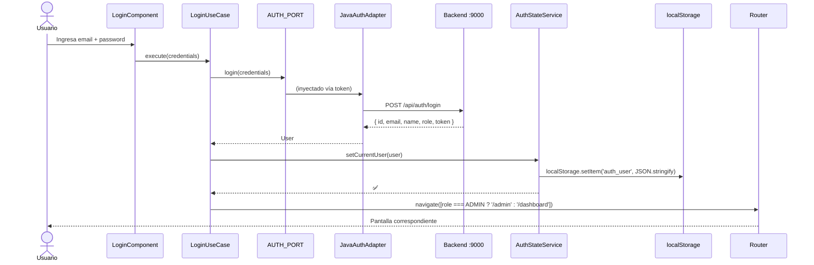
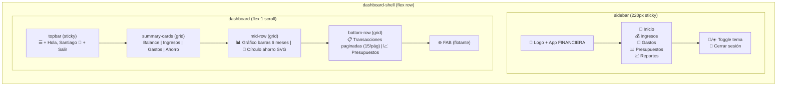
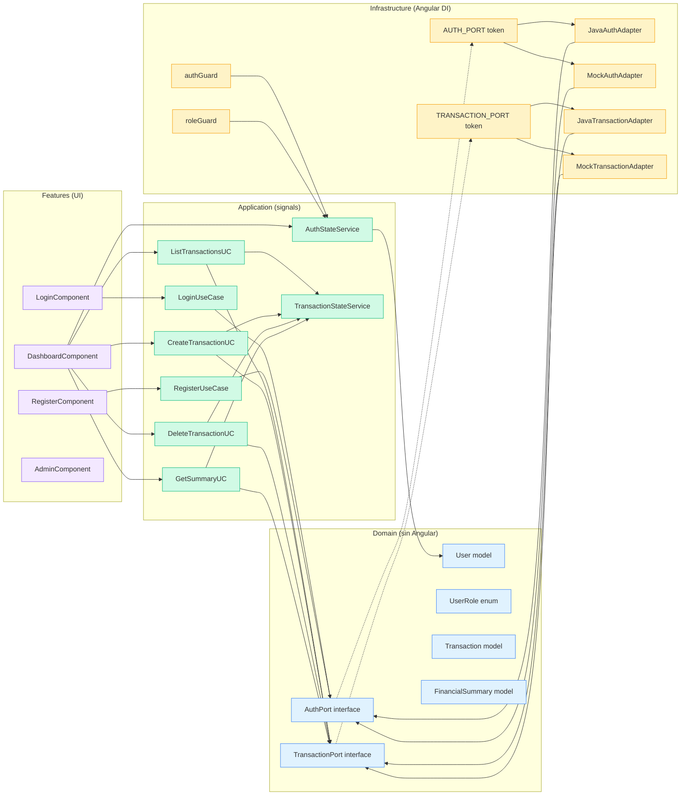

# Diagramas — App Financiera

## Diagrama de Componentes

```mermaid
graph TB
    subgraph "🌐 App Root"
        AppComponent["app.ts<br/>&lt;router-outlet /&gt;"]
        AppConfig["app.config.ts<br/>providers: Router, HttpClient,<br/>AUTH_PORT, ServiceWorker"]
        AppRoutes["app.routes.ts"]
    end

    subgraph "🔐 Core — Auth Domain"
        UserModel["user.model.ts<br/>interface User"]
        UserRole["user-role.model.ts<br/>enum UserRole"]
        AuthPort["auth.port.ts<br/>interface AuthPort<br/>login() | register() | logout()"]
    end

    subgraph "⚙️ Core — Auth Application"
        AuthState["auth-state.service.ts<br/>providedIn: root<br/>signals: currentUser,<br/>isAuthenticated, userRole<br/>localStorage SSR-safe"]
        LoginUC["login.use-case.ts<br/>@Injectable()"]
        RegisterUC["register.use-case.ts<br/>@Injectable()"]
    end

    subgraph "🔌 Core — Auth Infrastructure"
        AuthToken["AUTH_PORT<br/>InjectionToken"]
        JavaAdapter["java-auth.adapter.ts<br/>HttpClient → :9000<br/>POST /api/auth/*"]
        MockAdapter["mock-auth.adapter.ts<br/>MOCK_USERS in memory"]
        AuthGuard["auth.guard.ts<br/>CanActivateFn"]
        RoleGuard["role.guard.ts<br/>roleGuard(role)"]
    end

    subgraph "💰 Core — Finances Domain"
        TxModel["transaction.model.ts<br/>Transaction, TransactionType"]
        SummaryModel["summary.model.ts<br/>FinancialSummary"]
        BudgetModel["budget.model.ts<br/>Budget"]
        TxPort["transaction.port.ts<br/>TransactionPort<br/>getAll() | create() | delete()<br/>getSummary()"]
    end

    subgraph "📈 Core — Finances Application"
        TxState["transaction-state.service.ts<br/>providedIn: root<br/>signals: transactions,<br/>totalElements, summary,<br/>loading, error"]
        ListTxUC["list-transactions.use-case.ts"]
        CreateTxUC["create-transaction.use-case.ts"]
        DeleteTxUC["delete-transaction.use-case.ts"]
        GetSummaryUC["get-summary.use-case.ts"]
    end

    subgraph "🔧 Core — Finances Infrastructure"
        TxToken["TRANSACTION_PORT<br/>InjectionToken"]
        JavaTxAdapter["java-transaction.adapter.ts<br/>HttpClient → :9000<br/>/api/transactions/*"]
        MockTxAdapter["mock-transaction.adapter.ts<br/>32 tx mock, delay 400ms"]
    end

    subgraph "📊 Feature — Dashboard"
        Dashboard["dashboard.component<br/>signals: summary, transactions(32),<br/>budgets, monthlyChart, isDarkTheme<br/>computed: filteredTransactions,<br/>paginatedTransactions, txTotalPages"]
        IncomeModal["income-modal.component<br/>Categorías: Salario, Freelance,<br/>Inversión, Otro<br/>Acento: --color-blue"]
        ExpenseModal["expense-modal.component<br/>Categorías: Comida, Transporte,<br/>Vivienda, Ocio, Salud, Otro<br/>Acento: --color-red"]
    end

    subgraph "🔑 Feature — Login"
        Login["login.component<br/>Reactive Forms + signals"]
    end

    subgraph "📝 Feature — Register"
        Register["register.component<br/>Reactive Forms + passwordMatch"]
    end

    subgraph "👤 Feature — Admin"
        Admin["admin.component<br/>STUB — pendiente"]
    end

    subgraph "🎨 Sistema de Temas"
        LightTheme["Tema Claro (default)<br/>--bg-main: #F5F7FA<br/>--bg-card: #FFFFFF<br/>--text-primary: #1B263B"]
        DarkTheme["Tema Oscuro (.dark)<br/>--bg-main: #0D1B2A<br/>--bg-card: #1B263B<br/>--text-primary: #F5F7FA"]
        Accents["Acentos (ambos temas)<br/>--color-blue: #3B82F6<br/>--color-green: #10B981<br/>--color-red: #EF4444<br/>--color-purple: #8B5CF6"]
    end

    subgraph "☁️ Backend (Spring Boot)"
        API["http://localhost:9000<br/>POST /api/auth/*<br/>GET|POST|DELETE /api/transactions/*"]
    end

    %% Routing
    AppComponent --> AppRoutes
    AppRoutes -->|"/login"| Login
    AppRoutes -->|"/register"| Register
    AppRoutes -->|"/dashboard + authGuard"| Dashboard
    AppRoutes -->|"/admin + authGuard"| Admin

    %% Auth use case injection
    Login --> LoginUC
    Register --> RegisterUC
    LoginUC --> AuthToken
    RegisterUC --> AuthToken
    LoginUC --> AuthState
    RegisterUC --> AuthState

    %% Auth adapter swap
    AuthToken -.->|"useClass (activo)"| JavaAdapter
    AuthToken -.->|"useClass (dev)"| MockAdapter
    JavaAdapter --> AuthPort
    MockAdapter --> AuthPort
    JavaAdapter --> API

    %% Finance use case injection
    Dashboard --> ListTxUC
    Dashboard --> CreateTxUC
    Dashboard --> DeleteTxUC
    Dashboard --> GetSummaryUC
    ListTxUC --> TxToken
    CreateTxUC --> TxToken
    DeleteTxUC --> TxToken
    GetSummaryUC --> TxToken
    ListTxUC --> TxState
    CreateTxUC --> TxState
    DeleteTxUC --> TxState
    GetSummaryUC --> TxState

    %% Finance adapter swap
    TxToken -.->|"useClass (activo)"| JavaTxAdapter
    TxToken -.->|"useClass (dev)"| MockTxAdapter
    JavaTxAdapter --> TxPort
    MockTxAdapter --> TxPort
    JavaTxAdapter --> API
    TxPort --> TxModel
    TxPort --> SummaryModel

    %% Domain deps
    AuthState --> UserModel
    AuthState --> UserRole
    AuthPort --> UserModel

    %% Guards
    AuthGuard --> AuthState
    RoleGuard --> AuthState

    %% Dashboard children
    Dashboard --> IncomeModal
    Dashboard --> ExpenseModal
    Dashboard --> AuthState
    Dashboard --> TxState

    %% Theme
    Dashboard --> LightTheme
    Dashboard --> DarkTheme
    LightTheme --> Accents
    DarkTheme --> Accents
    IncomeModal -.->|"hereda CSS vars"| LightTheme
    ExpenseModal -.->|"hereda CSS vars"| LightTheme

    %% Config
    AppConfig --> AuthToken
    AppConfig --> TxToken
    AppConfig --> AuthGuard

    classDef domain fill:#E0F2FE,stroke:#3B82F6,color:#1B263B
    classDef app fill:#D1FAE5,stroke:#10B981,color:#1B263B
    classDef infra fill:#FEF3C7,stroke:#F59E0B,color:#1B263B
    classDef feature fill:#F3E8FF,stroke:#8B5CF6,color:#1B263B
    classDef theme fill:#FCE7F3,stroke:#EC4899,color:#1B263B
    classDef backend fill:#FEE2E2,stroke:#EF4444,color:#1B263B
    classDef root fill:#F1F5F9,stroke:#64748B,color:#1B263B

    class UserModel,UserRole,AuthPort,TxModel,SummaryModel,BudgetModel,TxPort domain
    class AuthState,LoginUC,RegisterUC,TxState,ListTxUC,CreateTxUC,DeleteTxUC,GetSummaryUC app
    class AuthToken,JavaAdapter,MockAdapter,AuthGuard,RoleGuard,TxToken,JavaTxAdapter,MockTxAdapter infra
    class Dashboard,IncomeModal,ExpenseModal,Login,Register,Admin feature
    class LightTheme,DarkTheme,Accents theme
    class API backend
    class AppComponent,AppConfig,AppRoutes root
```

---

## Flujo de Autenticación

```mermaid
sequenceDiagram
    actor U as Usuario
    participant LC as LoginComponent
    participant LUC as LoginUseCase
    participant AP as AUTH_PORT
    participant JA as JavaAuthAdapter
    participant API as Backend :9000
    participant AS as AuthStateService
    participant LS as localStorage
    participant R as Router

    U->>LC: Ingresa email + password
    LC->>LUC: execute(credentials)
    LUC->>AP: login(credentials)
    AP->>JA: (inyectado vía token)
    JA->>API: POST /api/auth/login
    API-->>JA: { id, email, name, role, token }
    JA-->>LUC: User
    LUC->>AS: setCurrentUser(user)
    AS->>LS: localStorage.setItem('auth_user', JSON.stringify)
    AS-->>LUC: ✅
    LUC->>R: navigate([role === ADMIN ? '/admin' : '/dashboard'])
    R-->>U: Pantalla correspondiente
```

---

## Layout del Dashboard

```mermaid
graph LR
    subgraph "dashboard-shell (flex row)"
        subgraph "sidebar (220px sticky)"
            Brand["🏦 Logo + App FINANCIERA"]
            Nav["📌 Inicio<br/>💰 Ingresos<br/>💸 Gastos<br/>📊 Presupuestos<br/>📈 Reportes"]
            Footer["🌙/☀️ Toggle tema<br/>🚪 Cerrar sesión"]
        end

        subgraph "dashboard (flex:1 scroll)"
            Topbar["topbar (sticky)<br/>☰ + Hola, Santiago 👋 + Salir"]
            Cards["summary-cards (grid)<br/>Balance | Ingresos | Gastos | Ahorro"]
            MidRow["mid-row (grid)<br/>📊 Gráfico barras 6 meses | 🎯 Círculo ahorro SVG"]
            BottomRow["bottom-row (grid)<br/>📋 Transacciones paginadas (15/pág) | 📈 Presupuestos"]
            FAB["⊕ FAB (flotante)"]
        end
    end

    Brand --> Nav --> Footer
    Topbar --> Cards --> MidRow --> BottomRow --> FAB
```

---

## Arquitectura Hexagonal

```mermaid
graph LR
    subgraph "Domain (sin Angular)"
        D1[User model]
        D2[UserRole enum]
        D3[AuthPort interface]
        D4[Transaction model]
        D5[FinancialSummary model]
        D6[TransactionPort interface]
    end

    subgraph "Application (signals)"
        A1[AuthStateService]
        A2[LoginUseCase]
        A3[RegisterUseCase]
        A4[TransactionStateService]
        A5[ListTransactionsUC]
        A6[CreateTransactionUC]
        A7[DeleteTransactionUC]
        A8[GetSummaryUC]
    end

    subgraph "Infrastructure (Angular DI)"
        I1[JavaAuthAdapter]
        I2[MockAuthAdapter]
        I3[AUTH_PORT token]
        I4[authGuard]
        I5[roleGuard]
        I6[JavaTransactionAdapter]
        I7[MockTransactionAdapter]
        I8[TRANSACTION_PORT token]
    end

    subgraph "Features (UI)"
        F1[LoginComponent]
        F2[RegisterComponent]
        F3[DashboardComponent]
        F4[AdminComponent]
    end

    F1 --> A2
    F2 --> A3
    F3 --> A1
    F3 --> A5
    F3 --> A6
    F3 --> A7
    F3 --> A8
    A2 --> D3
    A3 --> D3
    A1 --> D1
    A5 --> D6
    A6 --> D6
    A7 --> D6
    A8 --> D6
    A5 --> A4
    A6 --> A4
    A7 --> A4
    A8 --> A4
    D3 -.-> I3
    D6 -.-> I8
    I3 --> I1
    I3 --> I2
    I8 --> I6
    I8 --> I7
    I1 --> D3
    I2 --> D3
    I6 --> D6
    I7 --> D6
    I4 --> A1
    I5 --> A1

    classDef domain fill:#E0F2FE,stroke:#3B82F6
    classDef app fill:#D1FAE5,stroke:#10B981
    classDef infra fill:#FEF3C7,stroke:#F59E0B
    classDef feature fill:#F3E8FF,stroke:#8B5CF6

    class D1,D2,D3,D4,D5,D6 domain
    class A1,A2,A3,A4,A5,A6,A7,A8 app
    class I1,I2,I3,I4,I5,I6,I7,I8 infra
    class F1,F2,F3,F4 feature
```
